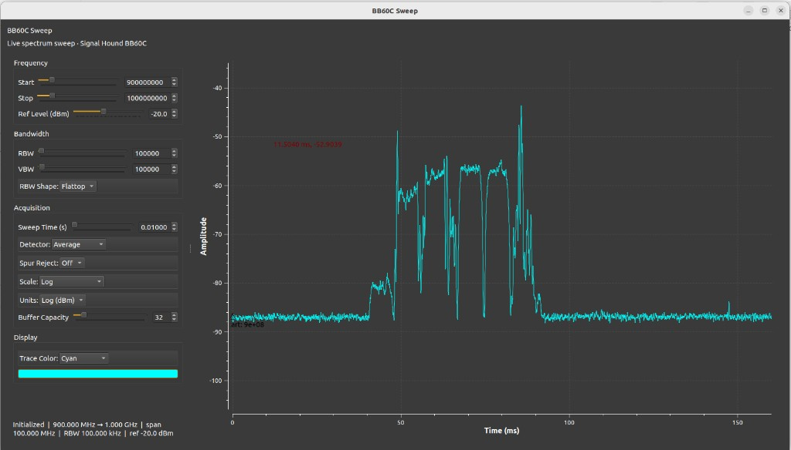
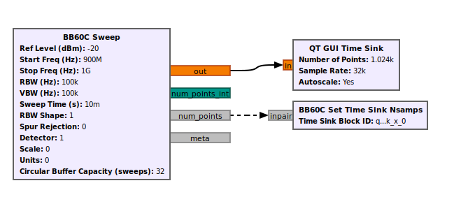

# A GNU Radio OOT module for the Signal Hound BB60C

`gr-bb60c` provides a continuous spectrum **sweep source** for the
[Signal Hound BB60C](https://signalhound.com/products/bb60c/) real-time spectrum
analyzer. Sweep bins are streamed as float samples with `sweep_start` tags so a
QT GUI Time Sink can show a stable, stationary spectrum display.



*Example application: live sweep with side-panel controls (frequency, bandwidth,
acquisition, display) and a QT Time Sink triggered on `sweep_start`.*

## Features

- `bb60c.bb60c_sweep` — continuous sweep source (float stream)
- Runtime parameter setters (start/stop frequency, RBW/VBW, detector, and more)
- Message ports: `num_points`, `meta`
- Optional second stream: `int32` sweep length per sample
- Helper block: `bb60c_set_time_sink_nsamps` — keeps the Time Sink length in sync
- Example Qt GUI with side-panel controls and QSS theme

## System Requirements

- 64-bit Linux (tested with GNU Radio 3.10 on Ubuntu-based systems)
- Native USB 3.0 support recommended for the BB60C
- Connected Signal Hound BB60C hardware (for live capture)

## Dependencies

### 1. Libusb 1.0

```bash
sudo apt-get update
sudo apt-get install libusb-1.0-0
```

Signal Hound devices normally need a `udev` rule so non-root users can open the
USB device. Example (vendor ID `2817`):

```
SUBSYSTEM=="usb", ATTR{idVendor}=="2817", MODE="0666", GROUP="plugdev"
```

Installing [Spike](https://signalhound.com/spike/) often sets this up
automatically.

### 2. FTDI D2XX library (BB60 series)

1. Download the Linux D2XX driver from [FTDI Chip](https://ftdichip.com/drivers/d2xx-drivers/)
   or use the copy bundled in the [Signal Hound SDK](https://signalhound.com/software/signal-hound-sdk/).
2. From the SDK tree (path may vary by Ubuntu version), install the shared library:

```bash
# Example path inside the Signal Hound SDK package:
cd "device_apis/bb_series/lib/linux/Ubuntu 18.04"
sudo cp libftd2xx* /usr/local/lib
cd /usr/local/lib
sudo chmod 0755 libftd2xx.so*
```

### 3. Signal Hound Device API (bb_api)

Grab the BB60 series shared libraries and headers from the
[Signal Hound SDK](https://signalhound.com/software/signal-hound-sdk/):

```bash
cd "device_apis/bb_series/lib/linux/Ubuntu 18.04"
sudo cp libbb_api.* /usr/local/lib
sudo ldconfig -v -n /usr/local/lib
sudo ln -sf /usr/local/lib/libbb_api.so.* /usr/local/lib/libbb_api.so
```

Also install the API header so CMake can find it:

```bash
# Adjust the source path to match your SDK layout
sudo cp device_apis/bb_series/include/bb_api.h /usr/local/include/
```

CMake looks for:

- Header: `bb_api.h` (e.g. `/usr/local/include`)
- Library: `libbb_api.so` (e.g. `/usr/local/lib`)

### 4. GNU Radio Companion

```bash
sudo apt-get install gnuradio
sudo apt-get install gnuradio-dev cmake libspdlog-dev clang-format
```

Also install Python Qt bindings for the example GUI:

```bash
sudo apt-get install python3-pyqt5
```

> **Note:** A `MATLAB` / MCR `LD_LIBRARY_PATH` override can break CMake discovery
> of system libraries. Unset or fix it if `cmake` fails unexpectedly.

## Installation

1. Clone this repository.
2. Build and install from the cloned repo:

```bash
git clone https://github.com/haghpanah/gr-bb60c.git
cd gr-bb60c
mkdir build && cd build
cmake ..
cmake --build . -j"$(nproc)"
sudo cmake --install .
sudo ldconfig
```

3. Restart GNU Radio Companion and choose **Reload Block Library**.

### Optional: local run without a full system install

```bash
./INSTALL_FIXED_LIB.sh
```

This copies the built shared library into `lib_runtime/` for the helper scripts.

## Usage

### GNU Radio Companion

1. Open [GNU Radio Companion](https://wiki.gnuradio.org/index.php/GNURadioCompanion).
2. From the module tree, add **BB60C Sweep** (`bb60c.bb60c_sweep`).
3. Connect `out` to a **QT GUI Time Sink**.
4. Connect message port `num_points` to **BB60C Set Time Sink Nsamps** (or a
   Message Pair to Var that calls `time_sink.set_nsamps`) so the sink length
   tracks the current sweep size.



*Minimal flowgraph: `bb60c_sweep` → QT GUI Time Sink, with `num_points` driving
`bb60c_set_time_sink_nsamps`.*

#### Time Sink tips

- **Trigger Mode** = Tag
- **Trigger Tag Key** = `sweep_start`
- Keep `num_points` wired so the number of samples matches the sweep length

Open the bundled reference graph:

```bash
gnuradio-companion examples/bb60c_sweep/untitled.grc
```

Set the GRC **Run Command** to `./run_bb60c_sweep_gui.sh` (from the repo root)
so Companion launches the polished GUI instead of regenerating `untitled.py`.

### Example GUI application

With the module installed (or `lib_runtime` prepared):

```bash
./run_bb60c_sweep_gui.sh
```

Or:

```bash
./examples/bb60c_sweep/run_untitled.sh
```

| File | Role |
|------|------|
| `examples/bb60c_sweep/bb60c_sweep_gui.py` | Polished application — edit this for UI |
| `examples/bb60c_sweep/bb60c_sweep.qss` | Stylesheet |
| `examples/bb60c_sweep/untitled.grc` | Flowgraph reference |
| `examples/bb60c_sweep/untitled.py` | GRC-generated; disposable |

## Module layout

```
gr-bb60c/
├── include/gnuradio/bb60c/   # Public API headers
├── lib/                     # C++ block implementation
├── python/bb60c/            # Python bindings
├── grc/                     # GRC block YAML
├── examples/bb60c_sweep/    # Example GUI + flowgraph
├── docs/                    # Doxygen + screenshots
└── apps/                    # Optional apps
```

Python import after install:

```python
from gnuradio import bb60c
```

## License

GPL-3.0-or-later — see [LICENSE](LICENSE) and SPDX headers in source files.

## Author

Mohammad Haghpanah
